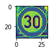

# **Build a Traffic Sign Recognition Classifier ** 

## The below Algorithm is applied to classify the traffic signs.

### The goals / steps of this project are the following:

*1. Import all dependencies
*2. Read data sets to train the algorithm.
*3. create a pipeline which takes the input data set and trains the algorithm.
*4. the trained algorithm is tested on the test data set to measure the accuracy of the whole algorithm
*5. Finally the algorithm is tested on the 6 german traffic signs downloaded from the web.

***Working of whole algorithm**

### Step 0 and Step 1 : Data Set Summary & Exploration

*1. The datasets(training,validation, test) are loaded using the pickle module. 
*2. After loading the datasets, the features and labels are separated, and stored in separate arrays called X_train, y_label etc.
*3. The channels of the image are verified so there is no dificulty in converting them to grayscale.
*4. Afer printing the shape, one random image is plotted using matplotlib module to get the insights about the color of the image.

#### 2. Include an exploratory visualization of the dataset.

*1. Next using matplotlib, a bar graph is plotted between each image count in training data versus its corresponding label.

### Step 2: Design and Test a Model Architecture

#### 1. Describe how you preprocessed the image data. What techniques were chosen and why did you choose these techniques? Consider including images showing the output of each preprocessing technique. Pre-processing refers to techniques such as converting to grayscale, normalization, etc. (OPTIONAL: As described in the "Stand Out Suggestions" part of the rubric, if you generated additional data for training, describe why you decided to generate additional data, how you generated the data, and provide example images of the additional data. Then describe the characteristics of the augmented training set like number of images in the set, number of images for each class, etc.)

*1. The whole dataset is converted to greyscale dataset to improve the accuracy.In grayscale image it is easy to detect the color difference and edges. To convert the image into grayscale two appraoches are   used :
(i) using the function cv2.cvtColor(*,*) of openCV module. 
(ii) using the simple numpy function{  np.sum(X_train/3, axis=3, keepdims=True) }  to club the 3 channels into one channel and take the average of all the pixel values in three channel.

Below is grayscale version of normal color image:

*2. The grayscale image is then normalized using the formula (pixel - 128)/ 128.The normaliztion will converge all image around [-1,1].
The technique will help to make our processing faster.

Below is mormalized grayscale image and simple grayscale image(without Normalization)

*3. After Normalization, each image is then passed through the pipeline which consists of the following functon:

***increasing image brightness.***

**********  In image brightness funtion[bright_image(image], the input is a normalized grayscale image . The image pixels are increased by adding the pixel values to each pixel. The maximum and minimum pixel values are calculate to calculate coefficient of each pixel with respspect to the maximum and minimum  value .the final output image is the brighter image.

***image scaling function.***
**********  In image scaling funtion the input is a bright-grayscale image . The image is passed to cv2.getPerspectiveTransform() of 
openCV module to perform the scaling on the image . the function reurns the scaled image.

***image translation function.***
**********  In image translation funtion, the input is a scaled-bright-grayscale image . The image is passed to cv2.warpAffine() of 
openCV module along with row and column count to perform the translation on the image . the function reurns the translated image.

Each image in the data set is passed to the above pipeline to process the image for better accuracy.The function are used to train the algorithm with different variants of saame image. For example, during bright sunny day the traffic will look more brighter, so to train algorithm for that type of image we have used the bright() to increase the learning capability of the image.

The augmented image is shown below:

#### 2. Describe what your final model architecture looks like including model type, layers, layer sizes, connectivity, etc.) Consider including a diagram and/or table describing the final model.

My final model consisted of the following layers:

| Layer         		|     Description	        					| 
|:---------------------:|:---------------------------------------------:| 
| Input         		| 32x32x1 Grayscale image   				    | 
| Convolution 3x3     	| 1x1 stride, Valid padding, outputs 28x28x6 	|
| RELU					|												|
| Max pooling	      	| 2x2 stride, Valid padding, outputs 14x14x6 	|
| Convolution 3x3	    | 1x1 stride, Valid padding, outputs 10x10x16	|
| RELU					|												|
| Max pooling	      	| 2x2 stride, Valid padding, outputs 5x5x16 	|
| Convolution 3x3     	| 1x1 stride, Valid padding, outputs 1x1x400 	|
| RELU					|												|
|flatten1 Layer-2 		|Input = 5x5x16. Output = 400					|
|flatten2 Layer-3		|Input = 1x1x400. Output = 400					|
| Concatenate(flatten1+flatten2)	|Input = 400 + 400. Output = 800	|
| Dropout					|											|
| Fully connected		|												|
| Softmax				| Input = 800. Output = 43   					|
|						|												|
|						|												|

To start the actual model , the preprocessed data set is shuffled to train the algorithm in better way.

###Implementaion of LeNet model:
 The System takes as input the whole training data set . As we know the size of each grayscale image is 32X32X1, we downgrade the image into 28x28x6 output.The whole working of all layers is as:
 
 ***Layer-1
 *** The mean and variance is selected as 0 and 0.01 respectively. In the convolution layer-1 the filter dimensions are calculated using the 
 
 formula given in the tutorials . Based on the filter size the weights are calculated. In layer-1 we we have used 6 filters to match with the output . The bias matrix is also calculated based on the numbers of filters. The stride is one for both height and weight.The batch size and features are taken as 1, 1 each, so the stride vector is [1,1,1,1]. Padding is taken as Valid in whole model.
The parameters along with input data is passed to tf.nn.conv2d(), which outputs the first convoluted neural network.

The covnet layer-1 is passed to activation funtion in our case we choose the activation function as RELU.
The outout from relu activation function is passed to max pooling function,which converts the Input = 28x28x6 to Output = 14x14x6.
Here the depth is keopt same.

****Layer-2****
The functionality and procedure of layer-2 is same as layer-1 with minor changes :

The filter size is increased from 5x5x3x6 to 5x5x6x16. Strides and padding is same as layer 1.
Further the implementation of activation and max poolong is same as that of layer-1

Layer-2 produces the convoluted neural network with size as---5x5x16

****Layer-3***
Here the filer dimensions are chosed as 5x5x16x400. to increase the depth to 400.
Activation function, strides and padding is same as previous layers. The output is 1x1xx400

**** Merging the outputs of two layers:***
The output from layer-2 and the output from layer-3 is merged as:
layer-2 output= 5x5x16, the whoole output is flatten to get the vector of size 400.
layer-3 output= 1x1x400, the whoole output is flatten to get the vector of size 400.
The outputs are concatenated and dropout is applied to limit the overfitting.

****Layer-4***

finally the output from dropout(800) is passed to function ( xW + b ) to get the final output.

#### 3. Describe how you trained your model. The discussion can include the type of optimizer, the batch size, number of epochs and any hyperparameters such as learning rate.

Learning rate: we have chosen the initial learning rate as 0.001 an then we tweak it to get better accuracy.
Epochs: Epochs are initially chosen as 60, later we have tweaked it.
Batch Size: We have trained the model on different batch sizes as 100, 128. To make sure that accuracy is increasing , we first start with 
128 batch size and then changed the size to 100 later. 
The traing data is passed to the LeNet pipeline to train the algoritm.

Optimizer: We have used AdamOptimizer because it gives the better accuracy the other optimzers like SGD and ADAGRAD.

#### 4. Describe the approach taken for finding a solution and getting the validation set accuracy to be at least 0.93. Include in the discussion the results on the training, validation and test sets and where in the code these were calculated. Your approach may have been an iterative process, in which case, outline the steps you took to get to the final solution and why you chose those steps. Perhaps your solution involved an already well known implementation or architecture. In this case, discuss why you think the architecture is suitable for the current problem.

After training the validation dataset is passed to the algoritm. For validation, we have chosen two validation datasets as:
1. One validation dataset is given with this project, on that dataset the framework gives the accuracy as:
Validation Accuracy = 0.955 = 95.5%

2. Other validation dataset is prepared from the training data set by splitting the training data set using sklearn's split function.
The accuracy on that dataset comes out to be :
Validation Accuracy = 0.991= 99.1 %

The framework gives the accuracy of 93.9% on test dataset.

My final model results were:
* training set accuracy of 99.1 %
* validation set accuracy of 95.5%
* test set accuracy of 93.9%

* What was the first architecture that was tried and why was it chosen?
We have chosen the LeNet architecture .This archetecture works well with the grayscale image. Due to the present of many layer , the learning capbility of the model increases sharply.

* What were some problems with the initial architecture?
The loss comes out to be very high, if we dont tweak the hyperparameters correctly.

* How was the architecture adjusted and why was it adjusted? Typical adjustments could include choosing a different model architecture, adding or taking away layers (pooling, dropout, convolution, etc), using an activation function or changing the activation function. One common justification for adjusting an architecture would be due to overfitting or underfitting. A high accuracy on the training set but low accuracy on the validation set indicates over fitting; a low accuracy on both sets indicates under fitting.

We have tweaked several hyperparameters to adjust the accuracy of the entire model. We have included various parameter iterativley in each layer as :
 Max pooling is used in layer 1 and in layer 2.
 Activation function used in each layer is ReLU.
 To avoid over fitting of the architecture we have used the dropout function.
 The whole architecture have total 3 layer and each layer is applying the convolution funtion.
 
* Which parameters were tuned? How were they adjusted and why?

Several parameters are adjusted as:
 Padding : In all layers the padding is kept as 'Valid' only
 Strides : The strides are changed to 1X1 to highlight each pixel. In max pooling th strides are chosen as 2x2.
 dropout probability: 0,5 for traing set and 1.0 for validation set.

### Step 3: Test a Model on New Images

#### 1. Choose five German traffic signs found on the web and provide them in the report. For each image, discuss what quality or qualities might be difficult to classify.

We have collected a bunch of 6 different german traffic signs from web and processed those images using the above steps.
The labels are set using the label names available on https://github.com/navoshta/traffic-signs/blob/master/signnames.csv.

The first image might be difficult to classify because I have chosen each image with some particular properties e.g 20 km/h image is little 
tilted towards left, so to classify that image is a difficult.Similarly other images are more bright, dim, less contrast etc. The algorithm correctly classifies 5 out of 6 images.

The framework gives the accuracy of 83.3% on these images.

#### 2. Discuss the model's predictions on these new traffic signs and compare the results to predicting on the test set. At a minimum, discuss what the predictions were, the accuracy on these new predictions, and compare the accuracy to the accuracy on the test set (OPTIONAL: Discuss the results in more detail as described in the "Stand Out Suggestions" part of the rubric).

Here are the results of the prediction:

| Image			        |     Prediction	        					| 
|:---------------------:|:---------------------------------------------:|
| Speed limit (20km/h)	| Roundabout mandatory (20km/h)					|
| Roundabout mandatory 	| Roundabout mandatory 							| 
| Ahead only    		| Ahead only 									|
| Speed limit (30km/h)	| Speed limit (30km/h)			 				|
| Priority road			| Priority road      							|
| Turn left ahead		| Turn left ahead      							|

The model correctly classified 5 of the 6 traffic signs, which gives an accuracy of 83.3%. The image that is predicted incorrectly, is tilted towards left that is the reason for its incorrect classification.

#### 3. Describe how certain the model is when predicting on each of the five new images by looking at the softmax probabilities for each prediction. Provide the top 5 softmax probabilities for each image along with the sign type of each probability. (OPTIONAL: as described in the "Stand Out Suggestions" part of the rubric, visualizations can also be provided such as bar charts)

The code for making predictions on my final model is located in the 11th cell of the Ipython notebook.

 The top six soft max probabilities were:

| Probability         	|     Prediction	        					| 
|:---------------------:|:---------------------------------------------:|
| 1.0					| Speed limit (20km/h)							|
| 1.0         			| Roundabout mandatory 							|
| 1.0     				| Ahead only 									|
| 1.0	      			| Speed limit (30km/h)			 				|
| 1.0				    | Priority road      							|
| 1.0				    | Turn left ahead      							|

### Conclusion:
The framwork can be made more efficient by using the advanced image prosessing techniques. Instead of grayscale conversion some other conversion format can be used to improve the accuracy. By changing the number of epochs and learning rate the accuracy can be enhanced also. Finally there are ample amount of parameteres which can be tweaked to get the test accuracy near to 100%.